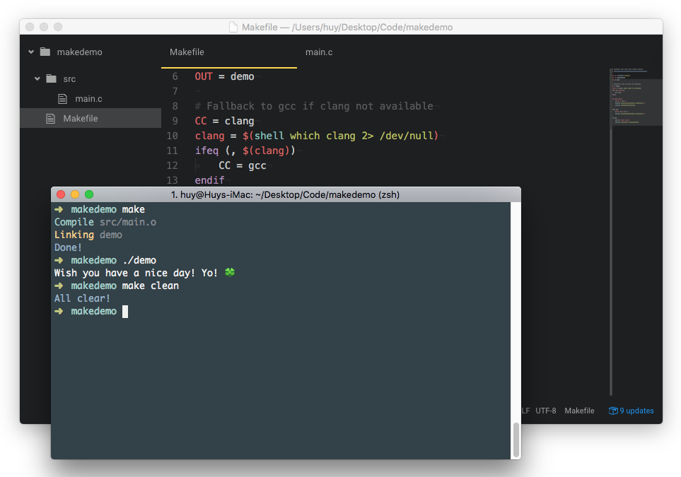

# Makefile Boilerplate



A starter config for standard C project with Makefile.

## What? What can it do???

- Auto build all source files in `src` folder
- Auto linking all `obj` files to execute binary
- Clean the project
- Colored output, and it's awesome

## Sound good! How do I use it?

It's very easy to use. All you need is `make` installed (and it's pre-installed in most of Unix and OS X system!).

With `make`, all you need to do is: `build` and `clean`.

**Build**

Build the project easily with:

```
make
```

All source files in `src` folder will be built and linked together to single executable `demo` binary file.

If you wish to change the output binary name, just change `OUT` variable to whatever you want.

```
OUT = demo
```

**Clean**

To cleanup your project, just type:

```
make clean
```

## You're cool man! But I don't use C :(

You don't use C, huh? It's OK man, don't be so ashamed! You should try it next time.

But the good news is, you can use it anywhere you want!

With `Makefile` pre-configured. You can use it in any standard C projects, C++ projects, or even Ruby, NodeJS, PHP, C#, Java projects...

It's nothing more than a task based bash script.

## Alright, how about license?

Since this one is nothing more than just a snippet, I don't care too much about licensing.

But if you asked, MIT.

By the way, I'm using something from the Makefile in [tj/luna](https://github.com/tj/luna) project.

**P/S:** The funny thing is, this `README.md` file is the largest file in this repository, LOL. I like to spend my time write up something helpful in my open source projects, so, I hope it will make you happy ^^!
